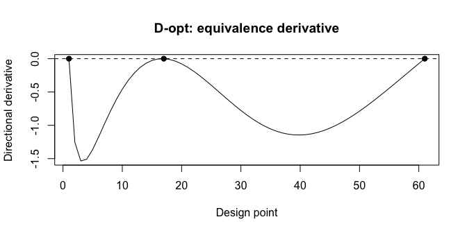
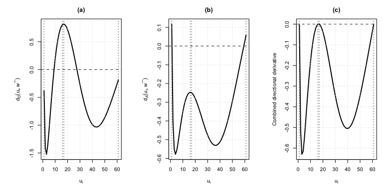
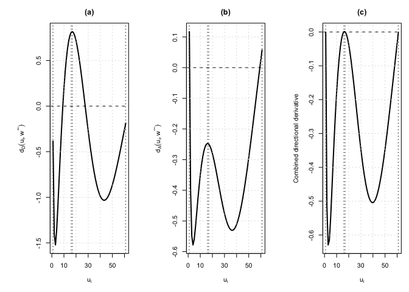
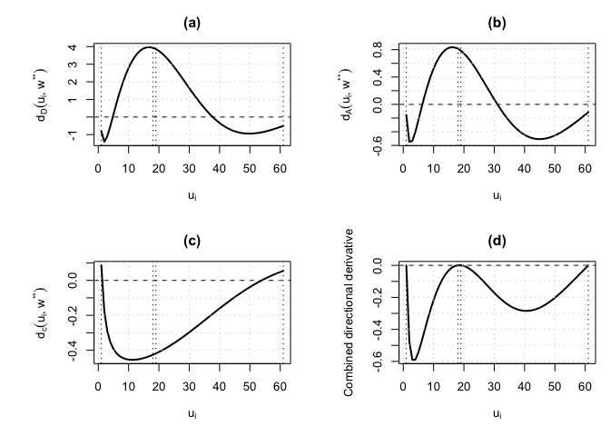

# gtDesign: Optimal designs for group testing experiments

April 9, 2026

- [Overview](#overview)
- [Installation](#installation)
- [Statistical model (Huang et al. 2020; Sec. 2 of
  arXiv:2508.08445)](#statistical-model-huang-et-al-2020-sec-2-of-arxiv250808445)
- [Package contents (exported)](#package-contents-exported)
- [Example: D-optimal design (Table 1, M = 61, q =
  0)](#example-d-optimal-design-table-1-m--61-q--0)
- [Example: A-optimal design (same theta, q =
  0)](#example-a-optimal-design-same-theta-q--0)
- [Example: Cost depending on pool size (q \>
  0)](#example-cost-depending-on-pool-size-q--0)
- [Example: c-optimality](#example-c-optimality)
- [Example: E-optimality via
  `compute_design_SO`](#example-e-optimality-via-compute_design_so)
- [Example: Equivalence theorem check
  (D-opt)](#example-equivalence-theorem-check-d-opt)
- [Maximin multi-objective designs](#maximin-multi-objective-designs)
- [Tables and Figures in the paper](#tables-and-figures-in-the-paper)
- [References](#references)
- [License](#license)
- [TODO](#todo)

[](https://www.gnu.org/licenses/gpl-3.0)

**Authors**

Chi-Kuang Yeh (Georgia State University)
[](https://orcid.org/0000-0001-7057-2096)

Weng Kee Wong (University of California, Los Angeles)
[](https://orcid.org/0000-0001-5568-3054)

Julie Zhou (University of Victoria)

<!-- badges: start -->

[](https://CRAN.R-project.org/package=gtDesign)
[](https://github.com/chikuang/gtDesign/actions/workflows/R-CMD-check.yaml)
[](https://github.com/chikuang/gtDesign)
[](https://cran.r-project.org/package=gtDesign)
[](https://cran.r-project.org/package=gtDesign)
[](https://cran.r-project.org/package=gtDesign)

<!-- badges: end -->

## Overview

`gtDesign` is an R package for **locally optimal approximate designs**
on a **finite candidate set** for **group testing** (pooled testing).
Designs are found by **convex optimization** via
**[CVXR](https://cran.r-project.org/package=CVXR)** (typically with the
**CLARABEL** solver).

The main application is the **Huang et al. (2020)** model for
prevalence, sensitivity, and specificity with optional **cost that
depends on pool size**, as used in **Yeh, Wong, and Zhou (2025)**; see
[arXiv:2508.08445](https://arxiv.org/abs/2508.08445). The same interface
also supports **generic nonlinear design** whenever the (approximate)
information matrix is a sum of rank-one terms
$\sum_i w_i h(x_i) h(x_i)^\top$.

## Installation

``` r
# install.packages("remotes")
remotes::install_github("chikuang/gtDesign")
```

``` r
# Alternative
devtools::install_github("chikuang/gtDesign")
```

**Requirements:** R ≥ 4.0 recommended; packages **CVXR**, **tibble**,
**MASS** (see `DESCRIPTION`). A conic solver reachable by CVXR
(e.g. **CLARABEL**) is required at runtime.

## Statistical model (Huang et al. 2020; Sec. 2 of arXiv:2508.08445)

Let $\theta = (p_0, p_1, p_2)$ denote **prevalence**, **sensitivity**,
and **specificity**, with $p_0 \in (0,1)$ and $p_1, p_2 \in (0.5, 1]$.
For a pool of size $x \in \{1,\ldots,M\}$, the **positive response
probability** is

$$\pi(x \mid \theta) = p_1 - (p_1 + p_2 - 1)(1 - p_0)^x .$$

**Standardized cost** (assay + enrollment) is

$$c(x) = 1 - q + q x, \qquad q = \frac{q_1}{q_0 + q_1} \in [0,1],$$

so $q = 0$ gives **constant cost per test** ($c(x) \equiv 1$), matching
the “equal cost” setting in Huang et al.

The **Fisher information matrix** for $\theta$ under independent
Bernoulli pool outcomes can be written as

$$\mathbf{I}(\mathbf{w}, \theta) = \sum_{j=1}^{M} w_j \, \lambda(x_j) \, \mathbf{f}(x_j) \mathbf{f}(x_j)^\top,$$

where $w_j$ are design weights on candidate pool sizes $x_j = j$,
$\sum_j w_j = 1$,

$$\lambda(x) = \frac{1}{c(x)\,\pi(x\mid\theta)\{1-\pi(x\mid\theta)\}},$$

and $\mathbf{f}(x) = \nabla_\theta \pi(x\mid\theta)$ is the gradient of
$\pi$ with respect to $\theta$ (see the paper for the explicit three
components).

### Regressor used in this package

Many functions (`calc_Dopt`, `calc_Aopt`, `check_equivalence`, …) assume
a **regression form**

$$\mathbf{M}(\mathbf{w}) = \sum_j w_j \, \mathbf{h}(x_j) \mathbf{h}(x_j)^\top$$

with **no separate `info_weight`**. That matches the Huang information
matrix if we set

$$\mathbf{h}(x) = \sqrt{\lambda(x)} \, \mathbf{f}(x).$$

The function **`gt_huang2020_regressor(theta, q)`** returns the function
`function(x)` that computes $\mathbf{h}(x)$. You can still use
**`compute_design_SO(..., info_weight = ...)`** with raw $\mathbf{f}$
and $\lambda$ if you prefer the factored form.

**Local optimality:** all designs are **local** with respect to a
**nominal** $\theta^\ast$ (and fixed $q$, $M$).

## Package contents (exported)

| Area | Functions |
|----|----|
| Huang (2020) building blocks | `gt_huang2020_pi`, `gt_huang2020_cost`, `gt_huang2020_lambda`, `gt_huang2020_f`, `gt_huang2020_regressor` |
| Classical approximate designs | `calc_Dopt`, `calc_Aopt`, `calc_copt` |
| Single-objective (D, A, Ds, c, E) | `compute_design_SO` |
| Maximin multi-objective | `maximin_design_workflow`, `compute_maximin_design`, `calc_eta_weights_maximin` |
| Equivalence | `check_equivalence`, `check_equivalence_maximin` |
| Plots | `plot_equivalence`, `plot_equivalence_maximin` |
| Directional derivatives | `calc_directional_derivatives`, `calc_multi_directional_derivative` |

## Example: D-optimal design (Table 1, M = 61, q = 0)

Nominal $\theta^\ast = (0.07, 0.93, 0.96)$ as in the paper; D-optimal
approximate design on $\{1,\ldots,61\}$ with $q=0$:

``` r
library(gtDesign)

theta <- c(p0 = 0.07, p1 = 0.93, p2 = 0.96)
M <- 61L
u <- seq_len(M)
f <- gt_huang2020_regressor(theta, q = 0)

res_d <- calc_Dopt(u, f, drop_tol = 1e-6)
res_d$design |> round(3)
```

      point weight
    1     1  0.333
    2    17  0.333
    3    61  0.333

``` r
res_d$status
```

    [1] "optimal"

Support points $\{1, 17, 61\}$ with weights $1/3$ each match **Table 1**
(D-criterion, $q=0$) in arXiv:2508.08445.

## Example: A-optimal design (same theta, q = 0)

``` r
res_a <- calc_Aopt(u, f, drop_tol = 1e-6)
res_a$design |> round(3)
```

      point weight
    1     1  0.416
    2    16  0.213
    3    61  0.371

## Example: Cost depending on pool size (q \> 0)

Larger $q$ puts more weight on enrollment in $c(x) = 1 - q + q x$. Use
`f <- gt_huang2020_regressor(theta, q)` with your chosen $q \in (0,1]$.

``` r
f_q <- gt_huang2020_regressor(theta, q = 0.2)
res_d_q <- calc_Dopt(u, f_q, drop_tol = 1e-6)
res_d_q$design
```

      point weight
    1     1 0.3333
    2    10 0.3333
    3    61 0.3333

## Example: c-optimality

Minimize the asymptotic variance of $\mathbf{c}^\top \hat{\theta}$ for a
user-specified $\mathbf{c}$ (length 3). Example $\mathbf{c} = (0,1,1)$
as in Table 1 of the paper:

``` r
c_vec <- c(0, 1, 1)
res_c <- calc_copt(u, f, cVec = c_vec, drop_tol = 1e-8)
subset(res_c$design, weight > 0.01)
```

      point weight
    1     1 0.5213
    4    56 0.1800
    5    57 0.2988

## Example: E-optimality via `compute_design_SO`

``` r
res_e <- compute_design_SO(
  u = u,
  f = f,
  criterion = "E",
  solver = "CLARABEL"
)
res_e$design
```

    # A tibble: 3 × 2
      point weight
      <int>  <dbl>
    1     1  0.415
    2    16  0.250
    3    61  0.335

## Example: Equivalence theorem check (D-opt)

``` r
eq_d <- check_equivalence(res_d, f = f, tol = 1e-4)
eq_d$max_violation
```

    [1] 2.217e-05

``` r
eq_d$all_nonpositive
```

    [1] TRUE

``` r
plot_equivalence(eq_d, main = "D-opt: equivalence derivative")
```



## Maximin multi-objective designs

The **maximin** formulation (Sec. 4 of
[arXiv:2508.08445](https://arxiv.org/abs/2508.08445)) maximizes the
**minimum efficiency** across several criteria. The workflow matches the
regression-design package
[**cvxDesign**](https://github.com/chikuang/cvxDesign) ([maximin
section](https://github.com/chikuang/cvxDesign#maximin-design)): first
obtain **reference losses** from single-objective optimal designs on the
**same** candidate set `u` and regressor `f`, then call
`compute_maximin_design()`. For group testing, `f` is typically
`gt_huang2020_regressor(theta, q)`; for polynomial regression, `f` can
be any `function(x)` returning a regressor vector (see cvxDesign
examples).

Chunks below call `library(gtDesign)`. When you edit package source and
re-render this file, run **`devtools::install()`** (from the package
root) first so the README runs against the installed version.

**Reference losses.** Losses must be on the **same scale** as
`compute_design_SO()` / internal `scalar_loss`: for **D**, the loss is
$-\log\det(\mathbf{M})$ (so if you use `calc_Dopt()`, pass
`D = -obj$value` because `calc_Dopt()$value` stores
$\log\det(\mathbf{M})$). For **A** and **c**, `calc_Aopt()` /
`calc_copt()` use the same scalar loss as `compute_design_SO()`.

### Step 1: single-objective reference designs (Huang model, D + A)

The chunks below reuse `u`, `f`, `res_d`, and `res_a` from the D-opt and
A-opt examples.

``` r
loss_ref <- list(
  D = -res_d$value,
  A = res_a$value
)
loss_ref
```

    $D
    [1] -5.796

    $A
    [1] 0.7058

### Step 2: maximin design (D and A)

``` r
res_da <- compute_maximin_design(
  u = u,
  f = f,
  loss_ref = loss_ref,
  criteria = c("D", "A")
)

res_da$design
```

    # A tibble: 4 × 2
      point weight
      <int>  <dbl>
    1     1  0.382
    2    16  0.114
    3    17  0.148
    4    61  0.356

``` r
res_da$efficiency
```

        D     A 
    0.987 0.987 

``` r
res_da$tstar
```

    [1] 1.013

The **efficiencies** should be approximately **equal** at a maximin
solution; **minimum efficiency** equals $1 / t^\ast$ where `tstar` is
returned by the solver.

### Step 3: numerical check (optional)

``` r
tol <- 1e-4
eq_eff <- abs(res_da$efficiency["D"] - res_da$efficiency["A"])
eq_t   <- abs(min(res_da$efficiency) - 1 / res_da$tstar)
eq_eff < tol && eq_t < tol
```

    [1] TRUE

### Step 4: directional derivatives and $\eta$ weights (equivalence)

Parameter dimension is $p = 3$ for $(p_0,p_1,p_2)$.
**`calc_eta_weights_maximin`** solves a small linear program; use the
**same** `f` (and `cVec` / `opts` for **c**) as in
`compute_maximin_design()`. If the default solver fails, try
`solver = "SCS"` and slightly relax `tol` (e.g. `1e-4`); see
`?calc_eta_weights_maximin`.

``` r
dd_da <- calc_directional_derivatives(
  u = u,
  M = res_da$info_matrix,
  f = f,
  criteria = c("D", "A")
)

eta_da <- calc_eta_weights_maximin(
  tstar = res_da$tstar,
  loss_ref = loss_ref,
  loss_model = res_da$loss,
  directional_derivatives = dd_da,
  criteria = c("D", "A"),
  q = 3,
  tol = 1e-4
)
eta_da
```

         D      A 
    0.1898 0.6205 

### Step 5: equivalence check and plot

``` r
eqm_da <- check_equivalence_maximin(
  design_obj = res_da,
  directional_derivatives = dd_da,
  eta = eta_da,
  tol = 1e-3
)
eqm_da$all_nonpositive
```

    [1] TRUE

``` r
eqm_da$support_equal_zero
```

    [1] TRUE

``` r
plot_equivalence_maximin(
  design_obj = res_da,
  directional_derivatives = dd_da,
  eta = eta_da,
  criteria = c("D", "A")
)
```



### Wrapper function

``` r
out <- maximin_design_workflow(
  u = u,
  f = f,
  criteria = c("D", "A"),
  make_figure = TRUE
)
```



``` r
out$maximin$efficiency
```

        D     A 
    0.987 0.987 

``` r
out$maximin$value
```

    [1] 0.987

``` r
out$maximin$tstar
```

    [1] 1.013

``` r
out$maximin$design
```

    # A tibble: 4 × 2
      point weight
      <int>  <dbl>
    1     1  0.382
    2    16  0.114
    3    17  0.148
    4    61  0.356

### Example: D + A + c (contrast $\mathbf{c} = (0,1,1)$)

Use the same contrast as in the c-optimal example (`c_vec`). Pass
`opts = list(cVec_c = c_vec)` whenever **c** is included.

``` r
loss_ref_dac <- list(
  D = -res_d$value,
  A = res_a$value,
  c = res_c$value
)

res_dac <- compute_maximin_design(
  u = u,
  f = f,
  loss_ref = loss_ref_dac,
  criteria = c("D", "A", "c"),
  opts = list(cVec_c = c_vec)
)

res_dac$efficiency
```

         D      A      c 
    0.8907 0.9587 0.8907 

Directional derivatives, $\eta$ weights, and equivalence for three
criteria (use a slightly looser tolerance on the combined derivative
because of numerical slack):

``` r
dd_dac <- calc_directional_derivatives(
  u = u,
  M = res_dac$info_matrix,
  f = f,
  criteria = c("D", "A", "c"),
  cVec = c_vec
)
eta_dac <- calc_eta_weights_maximin(
  tstar = res_dac$tstar,
  loss_ref = loss_ref_dac,
  loss_model = res_dac$loss,
  directional_derivatives = dd_dac,
  criteria = c("D", "A", "c"),
  q = 3,
  tol = 1e-3
)
check_equivalence_maximin(res_dac, dd_dac, eta_dac, tol = 0.002)$all_nonpositive
```

    [1] TRUE

``` r
plot_equivalence_maximin(
  res_dac,
  dd_dac,
  eta_dac,
  criteria = c("D", "A", "c")
)
```



## Tables and Figures in the paper

### Table 1

``` r
library(dplyr)
library(knitr)

theta <- c(p0 = 0.07, p1 = 0.93, p2 = 0.96)
u <- 1:61
q_val <- 0.8
f_q0 <- gt_huang2020_regressor(theta, q = q_val)

make_summary <- function(design, criterion) {
  design |>
    filter(weight > 1e-4) |>
    select(1, 2) |>
    rename(group_size = 1, weight = 2) |>
    mutate(weight = round(weight, 3)) |>
    summarise(
      Criterion = criterion,
      `Support points` = paste(group_size, collapse = ", "),
      Weights = paste(weight, collapse = ", ")
    )
}

tab_summary <- bind_rows(
  make_summary(calc_Dopt(u, f_q0)$design, "D-opt"),
  make_summary(calc_Aopt(u, f_q0)$design, "A-opt"),
  make_summary(calc_copt(u, f_q0, cVec = c(1, 0, 0))$design, "D_s-opt"),
  make_summary(calc_copt(u, f_q0, cVec = c(0, 1, 1))$design, "c-opt")
)

knitr::kable(
  tab_summary,
  format = "pipe",
  caption = paste0(
    "Support points and weights for approximate optimal designs ",
    "for the Huang (2020) group testing model with q = ", q_val,
    " on the design space {", min(u), ", ..., ", max(u), "}."
  )
)
```

| Criterion | Support points | Weights                    |
|:----------|:---------------|:---------------------------|
| D-opt     | 1, 7, 8, 61    | 0.333, 0.029, 0.304, 0.333 |
| A-opt     | 1, 8, 61       | 0.125, 0.183, 0.692        |
| D_s-opt   | 1, 7, 61       | 0.095, 0.573, 0.332        |
| c-opt     | 1, 56, 57      | 0.139, 0.322, 0.539        |

Support points and weights for approximate optimal designs for the Huang
(2020) group testing model with q = 0.8 on the design space {1, …, 61}.

### Table 2

``` r
u <- seq_len(150L)
f_q <- gt_huang2020_regressor(theta, q = 0.0)
res_d_q <- calc_Dopt(u, f_q, drop_tol = 1e-6)
res_a_q <- calc_Aopt(u, f_q, drop_tol = 1e-6)
loss_ref <- list(
  D = -res_d_q$value,
  A = res_a_q$value
)
loss_ref
```

    $D
    [1] -6.185

    $A
    [1] 0.5617

``` r
### Step 2: maximin design (D and A)

res_da <- compute_maximin_design(
  u = u,
  f = f_q,
  loss_ref = loss_ref,
  criteria = c("D", "A")
)

res_da$design
```

    # A tibble: 3 × 2
      point weight
      <int>  <dbl>
    1     1  0.409
    2    19  0.251
    3   150  0.339

``` r
res_da$efficiency
```

         D      A 
    0.9805 0.9805 

``` r
res_da$tstar
```

    [1] 1.02

``` r
### Step 3 numerical check
tol <- 1e-4
eq_eff <- abs(res_da$efficiency["D"] - res_da$efficiency["A"])
eq_t   <- abs(min(res_da$efficiency) - 1 / res_da$tstar)
eq_eff < tol && eq_t < tol
```

    [1] TRUE

### Figure 2

``` r
u <- seq_len(150L)
cVec <- c(1, 0, 0)
theta = c(0.07, 0.93, 0.96)
f_q <- gt_huang2020_regressor(theta, q = 0.2)
out <- maximin_design_workflow(
  u = u,
  f = f_q,
  criteria = c("D", "A", "c"),
  opts = list(cVec_c = cVec),
  make_figure = TRUE
)
```


``` r
out$maximin$efficiency
```

         D      A      c 
    0.9001 0.8545 0.8545 

``` r
out$maximin$value
```

    [1] 0.8545

``` r
out$maximin$tstar
```

    [1] 1.17

``` r
out$maximin$design
```

    # A tibble: 3 × 2
      point weight
      <int>  <dbl>
    1     1  0.158
    2    10  0.364
    3    75  0.478

### Table 3 (exact design via budget rounding, D-optimality)

Rounding Algorithm II in Sec. 5.1: approximate D-opt on `u`, then
\[round_gt_design_budget()\] for each total cost `C`. Re-run for
`C \in \{100, 500, 10000\}` (or as in the paper table).

``` r
theta <- c(p0 = 0.07, p1 = 0.93, p2 = 0.96)
u <- seq_len(150L)
q_cost <- 0.2
f <- gt_huang2020_regressor(theta, q_cost)

# calculate the approximate design
res_D <- calc_Dopt(u, f, drop_tol = 1e-6)

# Example: C = 100 (repeat for C = 500, 10000, ...)
out <- round_gt_design_budget(
  approx_design = res_D,
  u = u,
  theta = theta,
  C = 100,
  q_cost = q_cost,
  criterion = "D",
  fix_zero_floor = FALSE
)
out$C_remaining
```

    [1] 7.8

``` r
out$design_exact  
```

            [,1] [,2] [,3] [,4]
    x          1   10   11   67
    n_prime   35   12    1    2

``` r
out$efficiency    
```

    [1] 0.994

``` r
out$design_round1
```

            [,1] [,2] [,3]
    x          1   10   67
    n_prime   33   11    2

``` r
out$delta
```

            [,1] [,2] [,3]
    x          1   10   11
    Delta_n    2    1    1

``` r
# 8*(1 - q_cost + q_cost*1 ) # 8 
# 2*(1 - q_cost + q_cost*10) # 5.6
# 
# my_cost <- 0
# for (i in 1:ncol(out$design_round1)) {
#   my_cost <- out$design_round1[2, i] * (1 - q_cost + q_cost*out$design_round1[1,i]) + my_cost
# }
```

### Table 4 (maximin exact designs, arXiv Sec. 5.2)

Table 4 reports **exact** designs $\xi_{RAC}$ from the rounding
algorithms applied to **maximin** approximate designs on $M=61$,
$\boldsymbol{\theta}^*=(0.07,0.93,0.96)$. **MinEff** is
$\min_j \mathrm{Eff}_j$ at $\xi_{RAC}$; **$1/t^*$** is the minimum
efficiency of the maximin OAD (Table 2). Part (i) uses **fixed run
count** $n$ with $q=0$ (Rounding Algorithm I); part (ii) uses **budget**
$C$ with $q=0.2$ (Rounding Algorithm II). The helper functions
\[round_gt_design_n_maximin()\] and \[round_gt_design_budget_maximin()\]
provide reusable implementations for these two settings.

Example below shows **one Table 4 row**: DD-AA, $q=0.2$, $C=100$. It
should return $x=(1,10,59,61)$, $n=(26,8,1,3)$, and MinEff
$\approx 0.932$.

``` r
theta <- c(p0 = 0.07, p1 = 0.93, p2 = 0.96)
u <- seq_len(61L)
q_cost <- 0.2
f <- gt_huang2020_regressor(theta, q_cost)

# single-objective references used in maximin efficiencies
res_d <- calc_Dopt(u, f, drop_tol = 1e-6)
res_a <- calc_Aopt(u, f, drop_tol = 1e-6)
loss_da <- list(D = -res_d$value, A = res_a$value)

# maximin approximate design (D-A)
mm_da <- compute_maximin_design(
  u = u,
  f = f,
  loss_ref = loss_da,
  criteria = c("D", "A"),
  drop_tol = 1e-6
)

# exact design at C = 100 using Algorithm II + modified Step II (MinEff search)
out_da_100 <- round_gt_design_budget_maximin(
  approx_design = mm_da,
  u = u,
  theta = theta,
  C = 100,
  q_cost = q_cost,
  loss_ref = loss_da,
  criteria = c("D", "A")
)

out_da_100$design_exact
```

            [,1] [,2] [,3] [,4]
    x          1   10   59   61
    n_prime   26    8    1    3

``` r
out_da_100$delta
```

            [,1] [,2]
    x          1   59
    Delta_n    1    1

``` r
out_da_100$min_efficiency
```

    [1] 0.9318

``` r
1 / mm_da$tstar
```

    [1] 0.9487

The full chunk below is set to `eval=FALSE` so the README renders
quickly; set `eval=TRUE` to run all Table 4 rows.

``` r
theta <- c(p0 = 0.07, p1 = 0.93, p2 = 0.96)
u <- seq_len(61L)
q_cost <- 0.2
f <- gt_huang2020_regressor(theta, q_cost)

res_d <- calc_Dopt(u, f, drop_tol = 1e-6)
res_a <- calc_Aopt(u, f, drop_tol = 1e-6)
loss_da <- list(D = -res_d$value, A = res_a$value)

mm_da <- compute_maximin_design(
  u = u,
  f = f,
  loss_ref = loss_da,
  criteria = c("D", "A"),
  drop_tol = 1e-6
)
min(mm_da$efficiency)   # compare to 1/t* in Table 4
1 / mm_da$tstar

for (C in c(100, 500)) {
  out_da <- round_gt_design_budget(
    mm_da,
    u = u,
    theta = theta,
    C = C,
    q_cost = q_cost,
    criterion = "D"
  )
  ed_da <- exact_design_efficiency_maximin(
    out_da$M_exact,
    loss_da,
    c("D", "A")
  )
  list(C = C, design_exact = out_da$design_exact, min_eff = ed_da$min_efficiency)
}

res_ds <- calc_copt(u, f, cVec = c(1, 0, 0), drop_tol = 1e-6)
loss_dads <- list(D = -res_d$value, A = res_a$value, Ds = res_ds$value)
opts_ds <- list(cVec_Ds = c(1, 0, 0))

mm_dads <- compute_maximin_design(
  u = u,
  f = f,
  loss_ref = loss_dads,
  criteria = c("D", "A", "Ds"),
  opts = opts_ds,
  drop_tol = 1e-6
)

for (C in c(100, 500)) {
  out_3 <- round_gt_design_budget(
    mm_dads,
    u = u,
    theta = theta,
    C = C,
    q_cost = q_cost,
    criterion = "D",
    opts = opts_ds
  )
  ed_3 <- exact_design_efficiency_maximin(
    out_3$M_exact,
    loss_dads,
    c("D", "A", "Ds"),
    opts = opts_ds
  )
  list(C = C, design_exact = out_3$design_exact, min_eff = ed_3$min_efficiency)
}
```

Numerical values may differ slightly from the paper due to the CVXR
solver and the extension step in \[round_gt_design_budget()\]
(single-criterion merge for Step II).

## References

1.  Yeh, C.-K., Wong, W. K., Zhou, J. (2025). Single and multi-objective
    optimal designs for group testing experiments. *arXiv* 2508.08445.
    <https://doi.org/10.48550/arXiv.2508.08445>

2.  Huang, S.-Y., Chen, Y.-H., Wang, W. (2020). Optimal group testing
    designs for estimating prevalence with imperfect tests. *Journal of
    the Royal Statistical Society Series C*.

3.  Pukelsheim, F. (2006). *Optimal Design of Experiments*. SIAM.

4.  Fedorov, V. V. (1972). *Theory of Optimal Experiments*. Academic
    Press.

## License

GPL-3 — see the `License` field in `DESCRIPTION`.

## TODO

- [ ] Finish up the package documentation and vignettes.
- [ ] Add the rounding algorithms to obtain the optimal exact designs
